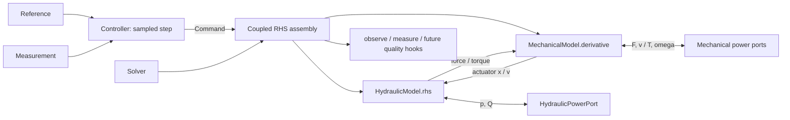

# R01 architecture

```mermaid
flowchart LR
  REF[Reference] --> CTRL[Controller: sampled step]
  MEAS[Measurement] --> CTRL
  CTRL -->|Command| COUPLED[Coupled RHS assembly]
  COUPLED --> HYD[HydraulicModel.rhs]
  COUPLED --> MECH[MechanicalModel.derivative]
  HYD -->|force / torque| MECH
  MECH -->|actuator x / v| HYD
  HYD <-->|p, Q| HP[HydraulicPowerPort]
  MECH <-->|F, v / T, omega| MP[Mechanical power ports]
  SOLVER[Solver] --> COUPLED
  COUPLED --> OBS[observe / measure / future quality hooks]
```

边界原则：控制器离散采样；物理模型提供连续 RHS；solver 不属于任何单一物理模块；耦合在同一次 RHS 评价中双向交换位移/速度与力/力矩。功率残差作为后续守恒测试接口。

